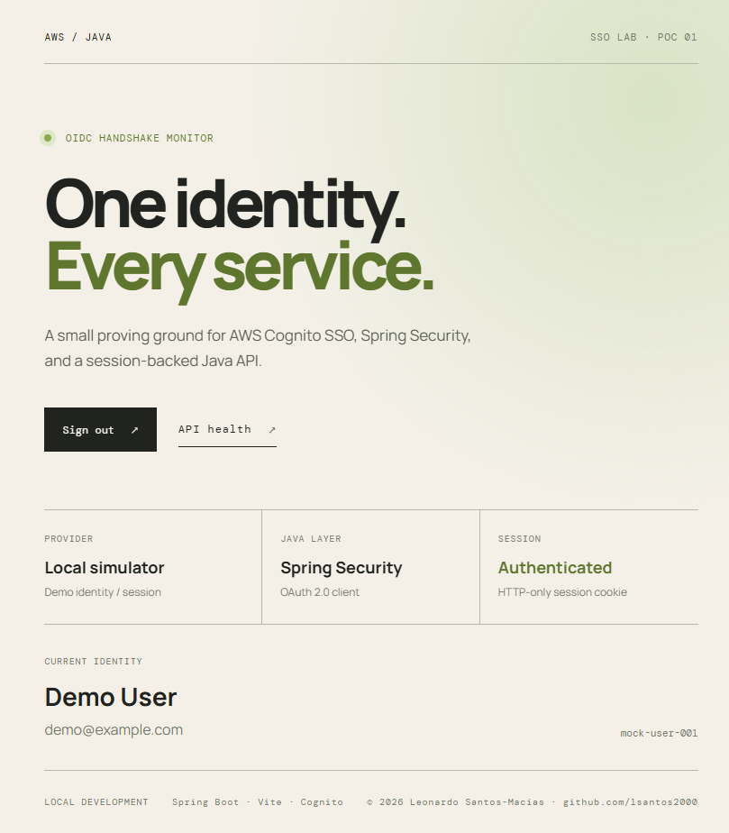
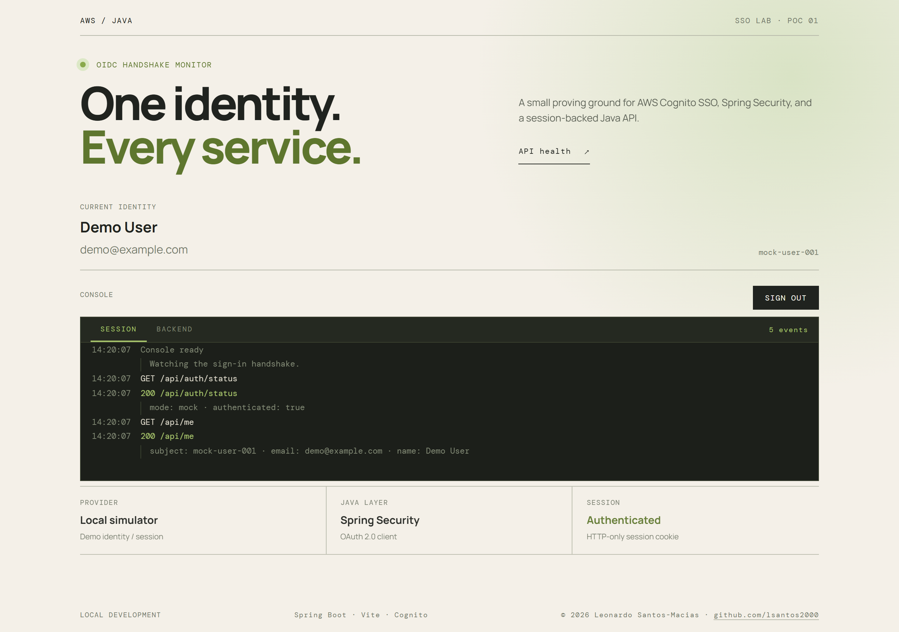
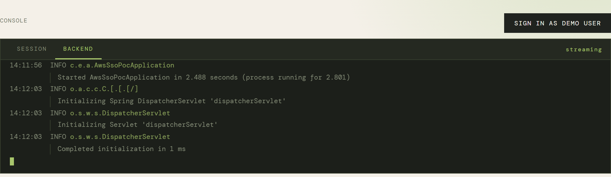
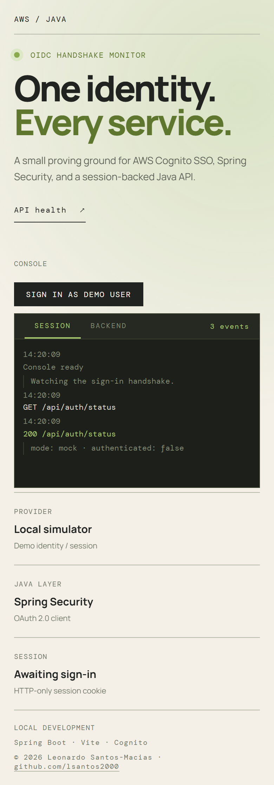

# AWS Java SSO POC

Proof of concept for AWS single sign-on using Java Spring Security and an interactive Vite frontend.

<!-- toc -->
## Contents

- [Architecture](#architecture)
- [What AWS Cognito SSO is](#what-aws-cognito-sso-is)
- [How this project demonstrates it](#how-this-project-demonstrates-it)
  - [Two ways to run the demo](#two-ways-to-run-the-demo)
  - [Watching it happen](#watching-it-happen)
- [Development prerequisites](#development-prerequisites)
  - [Required](#required)
  - [Recommended VS Code extensions](#recommended-vs-code-extensions)
  - [Optional](#optional)
- [Configure Cognito](#configure-cognito)
  - [1. Create the app client](#1-create-the-app-client)
  - [2. Create a user pool domain](#2-create-a-user-pool-domain)
  - [3. Set the environment variables](#3-set-the-environment-variables)
  - [4. Start on the local profile](#4-start-on-the-local-profile)
- [Run with the local simulator](#run-with-the-local-simulator)
- [Run with Cognito](#run-with-cognito)
- [How to test](#how-to-test)
  - [Run with Docker Compose](#run-with-docker-compose)
  - [Browser test with the local simulator](#browser-test-with-the-local-simulator)
  - [API test](#api-test)
  - [Automated tests](#automated-tests)
- [Troubleshooting](#troubleshooting)
- [Backend log streaming](#backend-log-streaming)
- [Scope and limitations](#scope-and-limitations)
- [Where the analysis lives](#where-the-analysis-lives)
- [Maintainer notes](#maintainer-notes)

<!-- /toc -->

## Architecture

- AWS Cognito provides the OIDC identity provider and hosted sign-in experience.
- Spring Boot and Spring Security OAuth2 Client handle the authorization-code flow and authenticated session.
- Vite, React, and TypeScript call `/api/auth/status` and `/api/me` with credentials included.
- An in-page console shows the handshake as it happens: a **SESSION** tab logging every request
  the page makes, and a **BACKEND** tab streaming the Spring Boot log over SSE.

## What AWS Cognito SSO is

An Amazon Cognito **user pool** is a managed user directory that also behaves as a standards
compliant OpenID Connect (OIDC) provider. Inside the pool, an **app client** represents one
application and holds its settings: which callback URLs are permitted, which OAuth flows are
allowed, and which scopes it may request.

Single sign-on here means this application never handles a password. It hands the browser to
Cognito's own sign-in page (AWS calls this **managed login**, previously the **hosted UI**);
Cognito authenticates the person against its directory or a federated provider it trusts, and
sends the browser back with a short-lived authorization **code**. The Java backend then exchanges
that code for tokens in a direct server-to-server call, using the client secret — the tokens never
travel through the browser's URL.

What makes it *single* sign-on: once someone has a session with the Cognito domain, any other app
client in the same pool can complete that same redirect without prompting again.

The pool publishes its own configuration, which is why the backend needs one URL rather than a
list of endpoints. `AWS_COGNITO_ISSUER_URI` is the pool's **issuer**:

```
https://cognito-idp.<region>.amazonaws.com/<user-pool-id>
```

Spring Security appends `/.well-known/openid-configuration` to that at startup and discovers the
authorization, token, and JWKS endpoints from the response. Set the issuer, not the discovery URL.

## How this project demonstrates it

The authorization-code flow, mapped to the routes in this repository:

| # | What happens | Where |
| --- | --- | --- |
| 1 | The page sends the browser to the authorization endpoint | `GET /oauth2/authorization/cognito` |
| 2 | Spring Security redirects to Cognito's managed login page | Cognito domain |
| 3 | The person signs in; Cognito redirects back with a code | `GET /login/oauth2/code/cognito` |
| 4 | Spring exchanges the code for tokens, server to server | backend → Cognito token endpoint |
| 5 | Spring creates a server-side session and sets `JSESSIONID` | `SecurityConfig` |
| 6 | The frontend reads the session, never a token | `GET /api/auth/status`, `GET /api/me` |
| 7 | Sign-out invalidates the session | `POST /api/auth/logout` |

The design decision worth noticing: **no token ever reaches the browser.** The ID token stays on
the server, and the frontend holds only an HTTP-only session cookie. `/api/me` returns a shaped
view of the identity — name, email, subject, and a whitelisted subset of claims — never the token,
and never the full claim set the provider happened to release.

### Two ways to run the demo

The project ships two Spring profiles so it can be demonstrated with or without an AWS account.

| | `mock` profile (default) | `local` profile |
| --- | --- | --- |
| AWS account | not needed | Cognito user pool required |
| Sign-in | `POST /api/auth/mock-login` | full redirect to managed login |
| Steps demonstrated | 5, 6, 7 | 1 through 7 |
| Security config | `MockSecurityConfig` | `SecurityConfig` |

Under `mock`, `MockAuthController` fabricates the same `OAuth2User` that Cognito would have
produced and writes it into the session. Everything *after* the identity provider is therefore the
real thing: the same Spring Security session, the same cookie, the same protected `/api/me`, the
same logout. What is simulated is only the identity provider itself.

Be clear about what that means: the `mock` profile does **not** exercise the redirect to Cognito,
the authorization-code exchange, or token validation. Those need the `local` profile and a real
user pool. The mock exists so the session model and the frontend can be explored without AWS
credentials, and so this repository stays runnable for anyone who clones it.

### Watching it happen

Both profiles are observable rather than opaque. The in-page console has a **SESSION** tab that
logs every request the page makes with its status and response, and a **BACKEND** tab that streams
Spring Boot's own log into the page. Signing in and reading the two tabs side by side is the point
of the demo — the handshake is visible instead of described.

## Development prerequisites

### Required

1. **Java JDK 21**
	- [Amazon Corretto 21 downloads](https://docs.aws.amazon.com/corretto/latest/corretto-21-ug/downloads-list.html)
	- Choose the installer for your operating system and CPU architecture. Apple Silicon users should select `macOS aarch64`.
2. **Apache Maven**
	- [Download Maven](https://maven.apache.org/download.cgi)
	- Download the binary archive or installer for your operating system. Maven runs using Java.
3. **Node.js LTS**
	- [Node.js downloads](https://nodejs.org/en/download)
	- Choose the `LTS` release and the installer matching your operating system and CPU architecture.
4. **Visual Studio Code**
	- [VS Code downloads](https://code.visualstudio.com/download)
	- Choose the build matching your operating system and CPU architecture.

### Recommended VS Code extensions

- [Extension Pack for Java](https://marketplace.visualstudio.com/items?itemName=vscjava.vscode-java-pack)
- [Spring Boot Extension Pack](https://marketplace.visualstudio.com/items?itemName=vmware.vscode-boot-dev-pack)

### Optional

- **Git:** [git-scm.com downloads](https://git-scm.com/downloads)
- **AWS CLI:** [AWS CLI installation guide](https://docs.aws.amazon.com/cli/latest/userguide/getting-started-install.html)
- **AWS account/Cognito:** Only required for the real AWS SSO flow. The local mock flow does not require AWS.

## Configure Cognito

Only needed for the `local` profile. The mock simulator requires none of this.

You need an existing Cognito **user pool** and the AWS CLI configured with credentials that can
administer it. Substitute your own region and user pool ID throughout.

### 1. Create the app client

This project is a **confidential client**: the backend holds a client secret and exchanges the
authorization code server to server. `--generate-secret` is therefore required — without it the
command succeeds but returns no `ClientSecret`, and the backend has nothing to authenticate with.

Bash, Git Bash, or WSL:

```bash
aws cognito-idp create-user-pool-client \
    --user-pool-id "YOUR_USER_POOL_ID" \
    --client-name "aws-java-sso-poc" \
    --generate-secret \
    --allowed-o-auth-flows "code" \
    --allowed-o-auth-scopes "openid" "profile" "email" \
    --allowed-o-auth-flows-user-pool-client \
    --supported-identity-providers "COGNITO" \
    --callback-urls "http://localhost:8080/login/oauth2/code/cognito" \
    --logout-urls "http://localhost:5173"
```

PowerShell (same command; the continuation character is a backtick, and nothing may follow it on
the line):

```powershell
aws cognito-idp create-user-pool-client `
    --user-pool-id "YOUR_USER_POOL_ID" `
    --client-name "aws-java-sso-poc" `
    --generate-secret `
    --allowed-o-auth-flows "code" `
    --allowed-o-auth-scopes "openid" "profile" "email" `
    --allowed-o-auth-flows-user-pool-client `
    --supported-identity-providers "COGNITO" `
    --callback-urls "http://localhost:8080/login/oauth2/code/cognito" `
    --logout-urls "http://localhost:5173"
```

Keep the `ClientId` and `ClientSecret` from the output. The secret is shown once here; retrieve it
later with `aws cognito-idp describe-user-pool-client --user-pool-id ... --client-id ...`.

The callback URL points at port **8080**, not 5173. Cognito redirects to the backend, which
performs the code exchange; the browser only reaches the frontend afterwards.

### 2. Create a user pool domain

The sign-in page (**managed login**, previously the **hosted UI**) does not exist until the pool
has a domain. Without one there is no authorization endpoint to redirect to, and sign-in fails
before Cognito is ever shown.

```bash
aws cognito-idp create-user-pool-domain \
    --user-pool-id "YOUR_USER_POOL_ID" \
    --domain "your-unique-prefix"
```

The prefix must be globally unique across AWS. This produces
`https://your-unique-prefix.auth.<region>.amazoncognito.com`. Spring never needs that URL directly
— it is discovered from the issuer in step 3 — but the pool will not serve a login page without it.

### 3. Set the environment variables

Set these in the same terminal you will start the backend from.

PowerShell:

```powershell
$env:AWS_COGNITO_CLIENT_ID = "your-app-client-id"
$env:AWS_COGNITO_CLIENT_SECRET = "your-app-client-secret"
$env:AWS_COGNITO_ISSUER_URI = "https://cognito-idp.us-east-1.amazonaws.com/your-user-pool-id"
```

Bash, Git Bash, or WSL:

```bash
export AWS_COGNITO_CLIENT_ID="your-app-client-id"
export AWS_COGNITO_CLIENT_SECRET="your-app-client-secret"
export AWS_COGNITO_ISSUER_URI="https://cognito-idp.us-east-1.amazonaws.com/your-user-pool-id"
```

These three names are what `backend/src/main/resources/application-local.yml` reads. There is no
YAML to write — the file already binds them:

```yaml
spring:
  security:
    oauth2:
      client:
        registration:
          cognito:
            client-id: ${AWS_COGNITO_CLIENT_ID}
            client-secret: ${AWS_COGNITO_CLIENT_SECRET}
        provider:
          cognito:
            issuer-uri: ${AWS_COGNITO_ISSUER_URI}
```

If you would rather bind Spring's properties directly, `SPRING_SECURITY_OAUTH2_CLIENT_REGISTRATION_COGNITO_CLIENT_ID`
and friends also work — but do not mix the two schemes. Starting the `local` profile with only the
`SPRING_*` names set fails at startup, because the placeholders above stay unresolved.

`AWS_COGNITO_ISSUER_URI` is the pool's issuer, not the discovery document. Spring appends
`/.well-known/openid-configuration` itself.

### 4. Start on the `local` profile

Follow [Run with Cognito](#run-with-cognito) below. The frontend button changes from
**Sign in as demo user** to **Continue with AWS SSO**, and the console's SESSION tab shows the
redirect rather than a mock login.

Never commit the client ID, client secret, or user pool ID. `.env` is git-ignored, and nothing in
this repository reads a checked-in credentials file.

## Run with the local simulator

No AWS account or Cognito values are required for the simulated flow.

Start the backend from `backend/`.

PowerShell:

```powershell
mvn spring-boot:run "-Dspring-boot.run.profiles=mock"
```

Bash, Git Bash, or WSL:

```bash
mvn spring-boot:run -Dspring-boot.run.profiles=mock
```

Then start the frontend from `frontend/`, in either shell:

```
npm run dev
```

> **PowerShell users:** the quotes are required. PowerShell ends a `-`-prefixed
> argument at the first `.`, so the unquoted form reaches Maven as two arguments,
> `-Dspring-boot` and `.run.profiles=mock`, and fails with
> `Unknown lifecycle phase ".run.profiles=mock"`. The quoted form works in every
> shell, so use it if you want one command that is safe to copy anywhere.

Open [http://localhost:5173](http://localhost:5173) and choose **Sign in as demo user**. The backend creates a session containing a demo identity, so you can exercise the frontend and protected `/api/me` endpoint locally.

## Run with Cognito

Set the environment variables above, then start the backend from `backend/`.

PowerShell:

```powershell
mvn spring-boot:run "-Dspring-boot.run.profiles=local"
```

Bash, Git Bash, or WSL:

```bash
mvn spring-boot:run -Dspring-boot.run.profiles=local
```

Then, from `frontend/`, run `npm install` followed by `npm run dev`.

Open [http://localhost:5173](http://localhost:5173). The Vite dev server proxies API and OAuth routes to port 8080.

## How to test

### Run with Docker Compose

With Docker installed, run this from the project root:

```bash
docker compose up --build
```

Open [http://localhost:5173](http://localhost:5173) and use the local simulator. Stop the stack with `Ctrl+C`, or run `docker compose down` from another terminal.

### Browser test with the local simulator

Follow the flow in order. The screenshots below show the expected application state at each important moment.

1. Start the backend with the `mock` profile.

	From the project root, run this in Terminal 1.

	PowerShell:

	```powershell
	cd backend
	mvn spring-boot:run "-Dspring-boot.run.profiles=mock"
	```

	Bash, Git Bash, or WSL:

	```bash
	cd backend
	mvn spring-boot:run -Dspring-boot.run.profiles=mock
	```

2. Start the frontend with Vite.

	In a separate Terminal 2, run:

	```bash
	cd frontend
	npm install
	npm run dev
	```

3. Open [http://localhost:5173](http://localhost:5173).
4. The opening screen shows the local simulator waiting for an identity.

   

5. Select **Sign in as demo user** in the console header. The frontend calls
   `/api/auth/mock-login`, and Spring Security creates the session cookie.
6. The application returns to the home screen and reports an authenticated session.
7. Confirm the identity panel displays `Demo User`, `demo@example.com`, and `mock-user-001`,
   and that the console's SESSION tab lists the whole exchange.

   

8. Switch the console to the **BACKEND** tab to watch the Spring Boot log stream in the page.

   

9. Select **Sign out**. The frontend calls `/api/auth/logout`, Spring Security invalidates the session, and the page returns to the signed-out state.

The layout is built to fit a single viewport, and stacks on small screens:



### API test

Check backend health:

```bash
curl http://localhost:8080/actuator/health
```

Expected response:

```json
{"status":"UP"}
```

Test the mock session from PowerShell:

```powershell
$session = New-Object Microsoft.PowerShell.Commands.WebRequestSession
Invoke-WebRequest http://localhost:8080/api/auth/mock-login -Method POST -WebSession $session
Invoke-RestMethod http://localhost:8080/api/me -WebSession $session
```

Test the mock session from Bash:

```bash
curl -i -c cookies.txt -X POST http://localhost:8080/api/auth/mock-login
curl -i -b cookies.txt http://localhost:8080/api/me
curl -i http://localhost:8080/api/me
rm cookies.txt
```

The first request should return `200` and save the session cookie. The second request should return `200` with the demo identity. The third request should return `401` or `403` because it does not include the session cookie.

The protected endpoint should return the demo identity. A request to `/api/me` without the session cookie should be rejected with HTTP `401` or `403`.

### Automated tests

From `backend/`:

```bash
mvn test
```

The suite includes controller unit tests, Spring `MockMvc` tests, and HTTP end-to-end tests for authentication status, identity claims, session cookies, protected endpoints, and logout. From `frontend/`:

```bash
npm test
npm run build
```

`npm test` runs the React/jsdom unit tests for signed-out, authenticated, and logout states. The production build validates TypeScript and Vite bundling. GitHub Actions runs all backend and frontend checks on pushes and pull requests targeting `main`.

## Troubleshooting

**"This site can't be reached" on [http://localhost:8080/actuator/health](http://localhost:8080/actuator/health)**
— nothing is listening on 8080. Start the backend. When it is running, that URL
returns `{"status":"UP"}` as JSON.

**A sign-in error naming the `mock` profile** — the backend is running the local
simulator, which has no Cognito endpoints. Either use the demo sign-in on the
page, or restart the backend with the `local` profile and Cognito credentials
set.

**The sign-in button says "Connecting…" and is disabled** — the page loaded
before the backend was reachable. Auth status is fetched once when the page
mounts, so start the backend and reload.

## Backend log streaming

The console's BACKEND tab reads `GET /api/logs/stream` (Server-Sent Events), with
`GET /api/logs/recent` as a buffered fallback. Both are registered only when
`app.log-stream.enabled` is `true`, which **only the `mock` profile sets**.

The endpoint is deliberately unauthenticated so the console can show the handshake
before a session exists. That means it publishes server log lines to anyone who can
reach it. That trade is acceptable for a local simulator and nowhere else — leave it
off under the `local` profile, and do not expose it beyond localhost.

Only four fields ever leave the server — time, level, abbreviated logger, formatted
message. Stack traces and thread detail stay server-side.

## Scope and limitations

**This is a local teaching artifact.** It is built to be read, run on a laptop, and explained. It
is deliberately not deployed anywhere, and it is not hardened for public exposure. That is a
decision, not an oversight — see [docs/PLAN-MULTI-APP.md](docs/PLAN-MULTI-APP.md) section 0.

Two consequences worth stating plainly:

**The backend defaults to the `mock` profile.** A build started without an explicit profile comes
up with the local simulator's sign-in endpoint enabled rather than Cognito. On a laptop that is
convenient. Anywhere reachable by other people it is an authentication bypass — anyone who can
reach the URL can call `POST /api/auth/mock-login` and receive a valid session. **Do not deploy
this image as it stands.**

**The backend log stream is unauthenticated.** See [Backend log streaming](#backend-log-streaming)
above. Same reasoning: fine locally, wrong anywhere else.

Both are tracked in the documents below.

## Where the analysis lives

| Document | What it covers |
| --- | --- |
| [docs/REVIEW.md](docs/REVIEW.md) | An assessment of the code as it stands: what holds up, what is missing, what I would build differently. Findings are marked **verified** or **by inspection**. |
| [docs/PLAN-MULTI-APP.md](docs/PLAN-MULTI-APP.md) | Why one backend cannot demonstrate SSO, what a two-app version would look like, what deploying would require, and the hardening list — re-scoped for a local artifact. |

Two questions those documents answer that come up immediately:

- **Does this actually demonstrate SSO?** Not yet. It demonstrates the OIDC session model with one
  application. Single sign-on needs a *second* relying party, so that signing into one app lets you
  into the other without a prompt. `PLAN-MULTI-APP.md` sections 1–5.
- **If it gets hardened, do I lose the mock?** No. Hardening makes the simulator explicit rather
  than removing it — `SPRING_PROFILES_ACTIVE=mock` is already how the documented workflow starts
  the backend. `PLAN-MULTI-APP.md` section 8.0.

## Maintainer notes

The contents list is generated. After adding, removing, or renaming a heading, run
`python scripts/toc.py` from the project root; it rewrites everything between the `<!-- toc -->`
markers and reports any anchor that does not resolve. Editing the list by hand works too, but the
anchors have to match GitHub's slug rules.

The screenshots in `docs/screenshots/` are generated by `scripts/screenshots.mjs`, which drives
the local mock flow with Playwright. To regenerate them, start both servers on the `mock` profile,
then from the project root:

```bash
npm install --no-save playwright
npx playwright install chromium
node scripts/screenshots.mjs
```

Playwright is deliberately **not** in `frontend/package.json`. It would add a large download to
every `npm ci` in CI, which never takes screenshots. `--no-save` keeps it out of the lockfile;
delete `node_modules/` from the project root when you are done.

The script writes `signed-out.png`, `signed-in.png`, `console-backend.png`, and
`signed-out-mobile.png`, and prints the rendered page height so you can check the layout still
fits one viewport. Everything it captures comes from the local simulator, so no screenshot can
contain a real identity — keep it that way, and never commit one showing cookies, access tokens,
or client secrets.

The backend requires Java 17+ and Maven. Java 21 is compatible.
